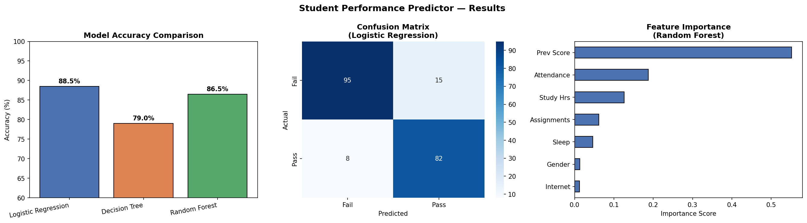

# 🎓 Student Performance Predictor

A Machine Learning project that predicts whether a student will **Pass or Fail** based on academic and behavioral features like attendance, study hours, previous scores, and more.

---

## 📌 Project Overview

This project trains and compares **3 ML classification models** on a dataset of **1,000 students** to find the best predictor of student academic outcomes. It covers the full ML pipeline — from data generation and preprocessing to model evaluation and visualization.

---

## 🛠️ Tech Stack

| Category | Tools |
|---|---|
| Language | Python 3.x |
| ML Library | Scikit-learn |
| Data Handling | Pandas, NumPy |
| Visualization | Matplotlib, Seaborn |

---

## 📊 Models Compared

| Model | Accuracy | F1 Score |
|---|---|---|
| Logistic Regression | **88.5%** | **87.7%** |
| Random Forest | 86.5% | 85.4% |
| Decision Tree | 79.0% | 74.7% |

✅ **Best Model: Logistic Regression with 88.5% accuracy**

---

## 🔢 Features Used

| Feature | Description |
|---|---|
| `attendance` | Attendance percentage (50–100%) |
| `study_hours` | Daily study hours (1–10 hrs) |
| `prev_score` | Previous exam score (30–100) |
| `assignments_done` | Assignments completed out of 10 |
| `sleep_hours` | Daily sleep hours (4–10 hrs) |
| `gender` | Male / Female |
| `internet_access` | Yes / No |

---

## 📈 Results



The chart shows:
- **Model accuracy comparison** across all 3 models
- **Confusion matrix** of the best model
- **Feature importance** from Random Forest

---

## 🚀 How to Run

**1. Clone the repository**
```bash
git clone https://github.com/Shreeya129/Student-Performance-Predictor.git
cd Student-Performance-Predictor
```

**2. Install dependencies**
```bash
pip install scikit-learn pandas numpy matplotlib seaborn
```

**3. Run the project**
```bash
python student_performance_predictor.py
```

---

## 💡 Sample Prediction

```
Input  : Attendance=80%, Study=5hrs, Prev Score=70, Assignments=8/10
Result : ✅ PASS
Pass Probability : 77.8%
Fail Probability : 22.2%
```

---

## 👩‍💻 Author

**Shreeya Trivedi**  
B.Tech Computer Science Engineering — Darshan University, Rajkot  
[LinkedIn](https://linkedin.com/in/shreeya-trivedi-a88901251) • [GitHub](https://github.com/Shreeya129)
